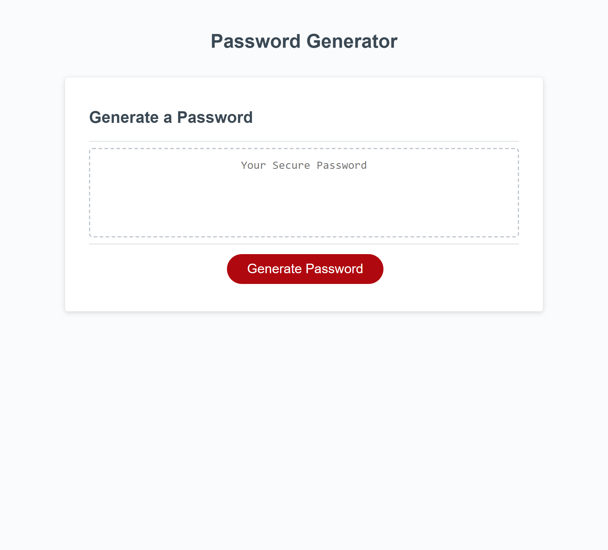

## The Project

This project is a simple and responsive web application that helps a user generate random passwords
based on their chosen criteria. It runs in the browser and features a polished user interfact
with dynamically updated HTML and CSS, yet is powered by JavaScript.

## Features

Responsive design that adapts to various screen sizes

Customizable password criteria, including length and character types

Input validation to ensure at least one character type is selected

Generated password displayed in the text box within the page

## Usage

1. Open the web application in your browser
2. Click on the red "Generate Password" button to start the process
3. Follow the alert prompts to specify you password criteria:
   Choose a length between 8 and 128 characters
   Choose to include lowercase, uppeercase, numeric, and special characters
4. Having completed the prompts, a password will be generated that meets your specified criteria
5. The generated password will be displayed in the text box above the red "Generate Password" button

## Image of Application

